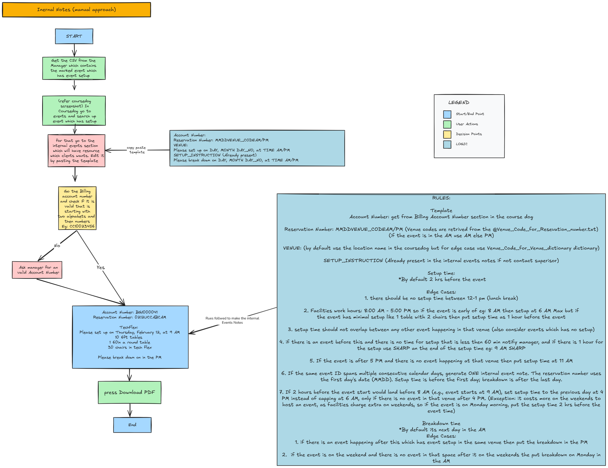
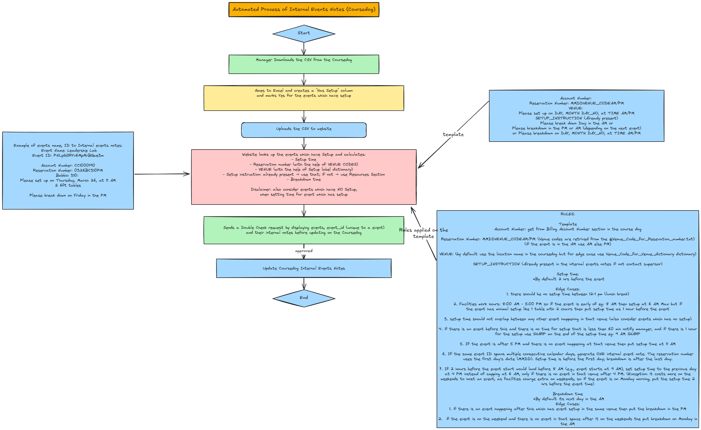

# Coursedog Internal Notes Generator

A Next.js app that automates writing internal event notes for the University Events team — replacing a tedious manual process with a one-click workflow.

---

## The Problem It Solves

### Before: Manual Process



Previously, a staff member had to:

1. Pull the event CSV from Coursedog manually
2. Look up the billing account number for each event
3. Look up venue codes for each location
4. Manually calculate setup and breakdown times (following a complex set of rules around lunch breaks, facility hours, prior/subsequent events, weekends, etc.)
5. Write out all notes by hand and email the completed template

This was error-prone and time-consuming, especially for large event weeks.

### After: Automated Process



The app automates everything:

1. Manager downloads the CSV from Coursedog and uploads it to the app
2. The app parses events, fetches billing accounts from the Coursedog API, calculates all setup/breakdown times, and generates formatted notes
3. The manager reviews and edits the generated notes in-browser
4. One click submits the notes back to Coursedog via the REST API

---

## Setup

### Prerequisites

- Node.js 18+
- A Coursedog service account with API access (see below)

### Creating a Coursedog Service Account

The app authenticates with the Coursedog API using email and password credentials. Your college email will not work here because it uses SSO (Single Sign-On). You need a separate Coursedog account tied to a personal email.

1. Log in to Coursedog with your college account
2. Go to **Settings** (bottom-left menu)
3. Click **Users** (bottom-left menu)
4. If you see an **Add User** button, click it and create a new account using a personal email (e.g. Gmail)
5. If you don't see **Add User**, you don't have admin privileges — ask your manager to either grant you admin access or create the account for you
6. Once the account is created, set its credentials in `.env.local`:

```env
COURSEDOG_EMAIL=yourpersonalemail@gmail.com
COURSEDOG_PASSWORD=the-password-you-set
```

### Install

```bash
npm install
```

### Environment Variables

Create a `.env.local` file in the project root:

```env
# Coursedog service account credentials
COURSEDOG_EMAIL=your-service-account@example.com
COURSEDOG_PASSWORD=your-password
COURSEDOG_SCHOOL_ID=stevens_workday
```

### Run

```bash
npm run dev       # Development server at localhost:3000
npm run build     # Production build
npm run start     # Start production server
npm run lint      # ESLint
```

---

## How to Use

### Step 1 — Export CSV from Coursedog

#### A. In Coursedog, navigate to your events view and edit the desired start and end date

#### B. Search for the events for which you want setup and do the following:

1. Update its Internal Events notes with the Setup Instructions you want
2. Toggle Facilities Request ? to YES

#### C. For new users follow this step, others skip to Step D:

1. Click on the Columns button on the top right
2. Uncheck: Meeting Type Column
3. Check the following Column names in Order:
   Internal Events Notes (General Event), Event ID, Facilities Request ? (General Event)
4. Click on Saved views and select save Current view and give it a desired name

#### D. Go to saved views and click on the view you saved before.

#### E. Export the event list as a CSV file.

### Step 2 — Upload the CSV

Open the app at `http://localhost:3000` and upload the CSV. The app will:

- Parse and group events by name, building, and date cluster
- Fetch each event's billing account from the Coursedog API
- Calculate setup and breakdown times using the full rule set (see below)
- Generate formatted internal notes for each event

### Step 3 — Review and Download

The Review page displays all generated notes. You can edit any note inline before downloading. Notes that require manager attention (e.g., tight setup windows under 60 minutes) are flagged automatically. Click **Download CSV** to save the notes as a CSV file.

---

## Note Generation Rules

Setup time logic (in priority order):

1. Default setup is **2 hours before** event start
2. No setup during the **12–1 PM lunch break**
3. Earliest possible setup is **6 AM** (facility hours: 8 AM–5 PM) but if
   the event has minimal setup like 1 table with 2 chairs then put setup time as 1 hour before the event
4. If less than 60 min after a prior event in the same venue → **warn manager**; if exactly 60 min → append **"SHARP"**
5. Post-5 PM events with a free venue → setup at **11 AM**
6. Early morning outdoor events with minimal setup → **1 hour before**
7. If the event start would be before 8 AM → prior-day setup at **4 PM** (if venue is free); Monday events keep 2 hrs before (weekend premium)

Breakdown time logic:

1. Default: **next day in the AM**
2. If a subsequent event has setup in the same venue the same day → **same day PM** use Coursedog API to check
3. Only for Indoor events: Weekend event with no weekend follow-up → **Monday in the AM**

---

## Architecture

```
CSV Upload → Parse Rows → Group Events → Fetch Coursedog Events → Generate Notes → Review/Edit → Submit to Coursedog API
```

| Module                      | Purpose                                                         |
| --------------------------- | --------------------------------------------------------------- |
| `src/lib/note-generator.ts` | All setup/breakdown time calculation logic (~350 lines)         |
| `src/lib/csv-parser.ts`     | Parses CSV, normalizes dates/times, groups events into clusters |
| `src/lib/coursedog.ts`      | Coursedog REST API client with 23-hour bearer token cache       |
| `src/lib/venue-codes.ts`    | Maps 200+ location strings to short venue codes                 |
| `src/lib/types.ts`          | Shared TypeScript types                                         |
| `src/app/`                  | Next.js App Router pages and API routes                         |

Notes are passed between the Upload and Review pages via `sessionStorage` — there is no database.

---

## Coursedog API Details

- Base URL: `https://app.coursedog.com/api/v1`
- Auth: Bearer token (fetched from credentials, cached for 23 hours)
- Custom field IDs used:
  - `BILLING_ACCOUNT`: `KzOtm`
  - `INTERNAL_NOTES`: `kIyJw`
  - `FACILITIES_REQUEST`: `53DcH`
  - `MANAGER_NAME`: `97Sir`
